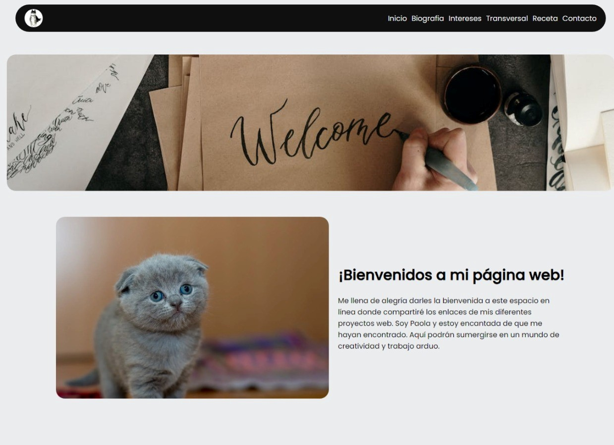

<h1 align="center" >Proyecto Web</h1>

Pagina estatica simple

 
 
 
 
 

    

El proyecto consiste en la creación de una página web simple para la materia de "Páginas Web". La página se desarrollará utilizando únicamente HTML y CSS, sin hacer uso de JavaScript. Será una página estática que incluirá una biografía, información de contacto y otros proyectos relacionados.

La estructura principal de la página se centrará en presentar la biografía del autor. Se incluirá información relevante sobre su trayectoria, logros y experiencias destacadas. Se prestará especial atención a la organización del contenido, utilizando etiquetas HTML adecuadas para los distintos elementos y asegurando una presentación atractiva mediante la aplicación de estilos CSS.

Además de la biografía, se incluirá una sección de contacto, donde los visitantes podrán encontrar información como dirección de correo electrónico, número de teléfono y perfiles de redes sociales. Esta sección se diseñará de manera que sea fácil de encontrar y utilizar.

El proyecto también incluirá la presentación de otros dos proyectos adicionales. Uno de ellos estará enfocado en crear conciencia sobre las adicciones, proporcionando información relevante y recursos útiles para aquellos que necesiten ayuda. El segundo proyecto será una página que presente una receta de cocina, brindando instrucciones detalladas y una lista de ingredientes.

El diseño de la página web se basará en la combinación de colores apropiados, fuentes legibles y un diseño limpio y profesional. Se utilizarán estilos CSS para garantizar una apariencia coherente en todas las secciones de la página y se prestará atención a la legibilidad del texto.

## 🦉 Caracteristicas

- [x] Diseño limpio y minimalista
- [x] Código estructurado por secciones
- [x] Informacion clara y detallada
- [x] Código limpio

## 📑 Licencia

Este proyecto se publica bajo los términos de la licencia MIT. La licencia MIT permite a los usuarios utilizar, copiar, modificar y distribuir el código fuente del proyecto con ciertas restricciones y requisitos. Para más información sobre los términos y condiciones de la licencia MIT, consulte el archivo de licencia incluido con este proyecto o visite https://opensource.org/licenses/MIT.

---

  
  

